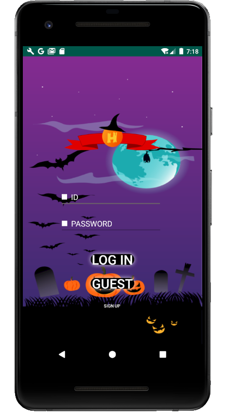
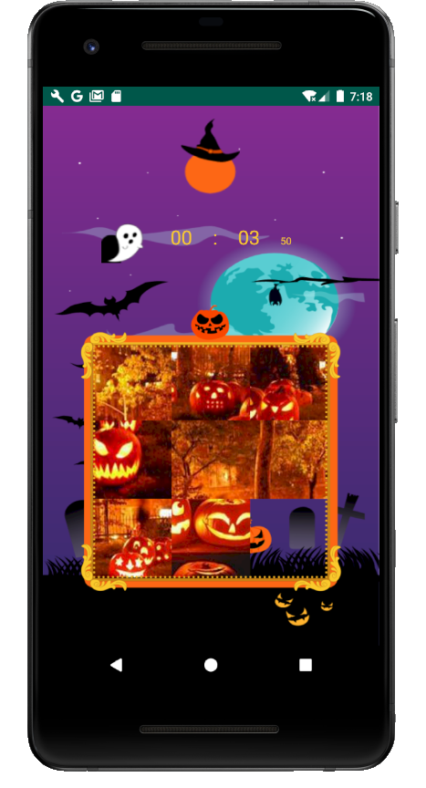

# Halloween-pop


할로윈을 맞이해서 무박 2일 SOPT 해커톤에서 개발한 어린 아이들을 대상으로한 퍼즐게임이다. 각 단계별로 다른 이미지로 이루어진 게임이 진행되고, 9단계까지 클리어한 유저는 랭킹에 자기 점수를 남길 수 있다.

[해커톤 후기: 윤자이 기술블로그](https://ooeunz.tistory.com/44?category=814287)

\
[]()

---
\
\
\
[]()
## Info
**Features**
* **AWS-EC2로 배포.**
* 암호화를 이용한 로그인 기능.
* 클리어 시간을 기준으로 한 score 등록.
* 모든 stage를 클리어한 경우 ranking 등록 및 기록 재갱신 기능.


\
\
[]()
**API Description**
* [API 명세서 링크](https://github.com/SOLscript/SOLscript_server/wiki)


\
\
[]()
**Mock up Img**

\
\
[]()

---
\
\
\
[]()
## Usage Package

```json
"dependencies": {
    "canvas": "^2.6.0",
    "image-to-slices": "^0.1.3"
  }
```
클라이언트에서 각 stage에 대한 요청이 있을 때 image-to-slices package를 사용해서 이미지를 9등분으로 나눠서 클라이언트로 전송해주었다.
\
\
\
[]()
```json
"dependencies": {
    "encrypt": "0.0.1",
    "pbkdf2": "^3.0.17"
}
```
encrypt와 pbkdf2 패키지를 이용한 암호화를 통해 로그인 보안을 강화하였다.
\
\
\
[]()
```json
"dependencies": {
    "promise-mysql": "^4.1.1",
}
```
AWS RDS를 이용해서 MySQL을 비동기적으로 사용하였다.
\
\
[]()

---
\
\
\
[]()
## Application Image

| Login | Game |
|:---:|:---:|
|||